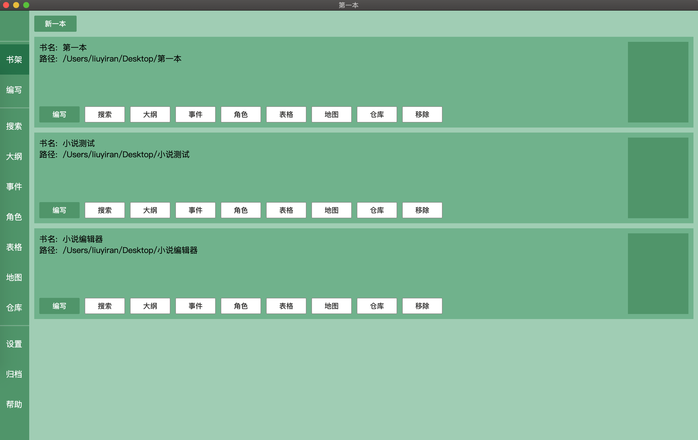
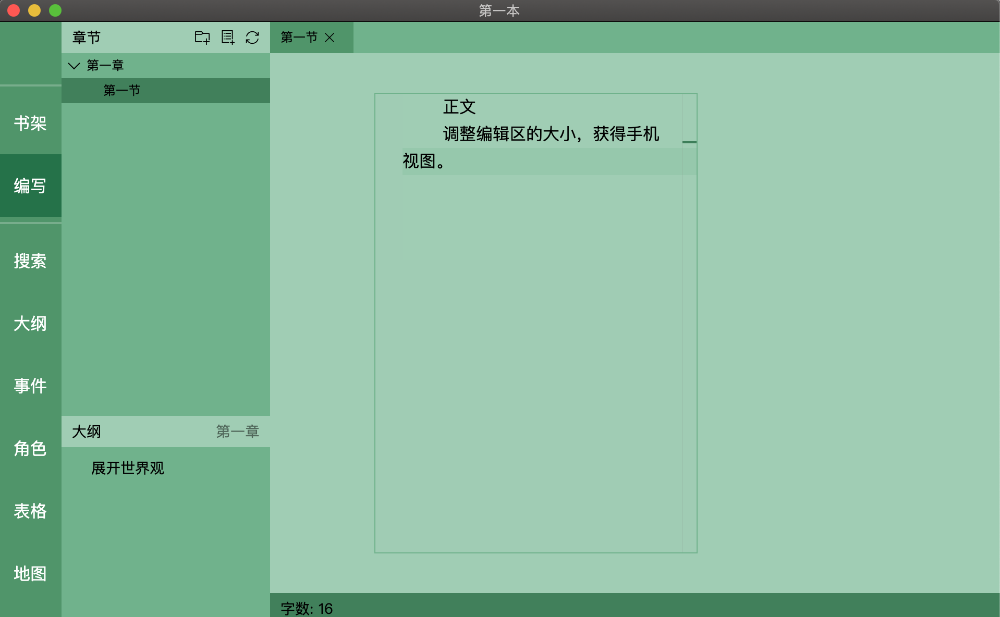
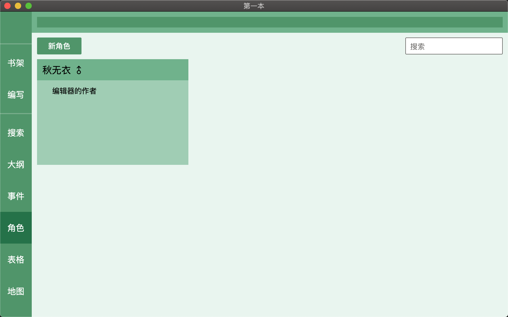
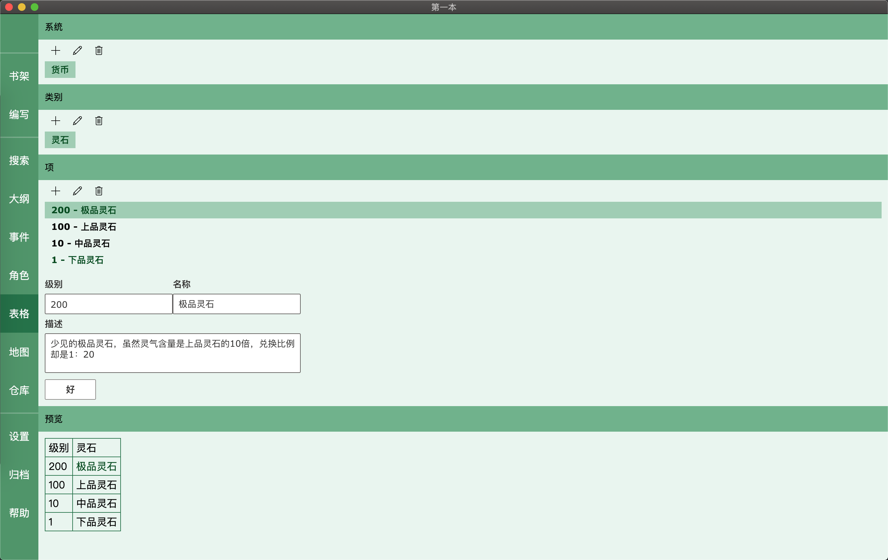
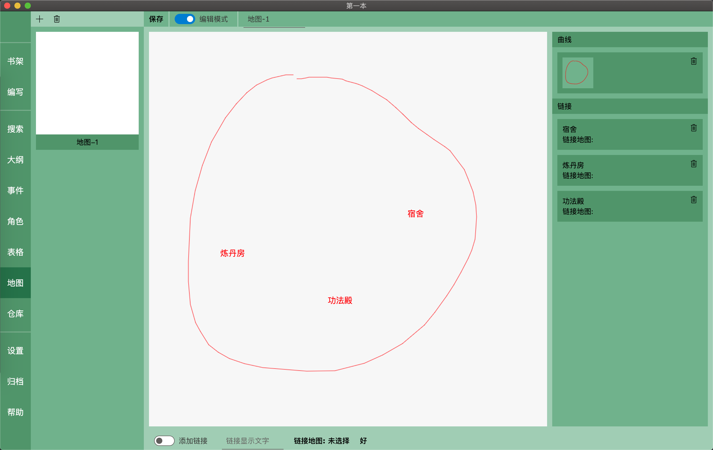

# 小说编辑器







## 链接

[秋无衣-bilibili](https://space.bilibili.com/37384331)

## 工作区说明

使用 yarn workspace, view 为显示内容, elec 为 electron 服务

#### 环境

-   [node](http://nodejs.cn/download/)
-   [yarn](https://www.yarnpkg.com/lang/en/)

#### 几个重要的依赖

-   typescript
-   rxjs
-   monaco-editor

#### 安装依赖

```
// 顶层
yarn -W
yarn add some -W
// package内与普通yarn命令一致
```

#### 开发启动

```
// page部分
第一次 view 先执行 setup-dll 命令
// 见page下package.json start
```

```
// electron部分
// 见electron下package.json
先watch, 实时编译
在electron-start启动electron开发
```

#### 打包

1. 先执行 page 的 build
2. 再执行 elec 的 electron-build

---

## 常见问题

#### electron 安装

很奇怪, mac 上没问题, windows 上没有 dist 和 path.txt

1. 打开[electron-release](https://github.com/electron/electron/releases?after=v9.0.0-nightly.20191222)

1. 找到 electron-{version}-win32-x64.zip, 自行对应系统和版本

1. 打开项目下的 node_modules/electron

1. 放入解压的 dist

1. 添加 path.txt, 在 install.js 找到要写的内容, windows: electron.exe; mac: Electron.app/Contents/MacOS/Electron

#### 某个包安装被墙卡住

```
yarn config set registry https://registry.npm.taobao.org -g

yarn config set sass_binary_site http://cdn.npm.taobao.org/dist/node-sass -g

electron需要再npmconfig也设置, 如果碰到百度下怎么整
```

#### socketio

```
Cannot find module 'socket.io-client/dist/socket.io.js'
报这个错误
执行 elec/scripts/help-socketio.js 文件即可
```

#### 页面项目启动需要 dll

执行 view 下的 setup-dll 命令
